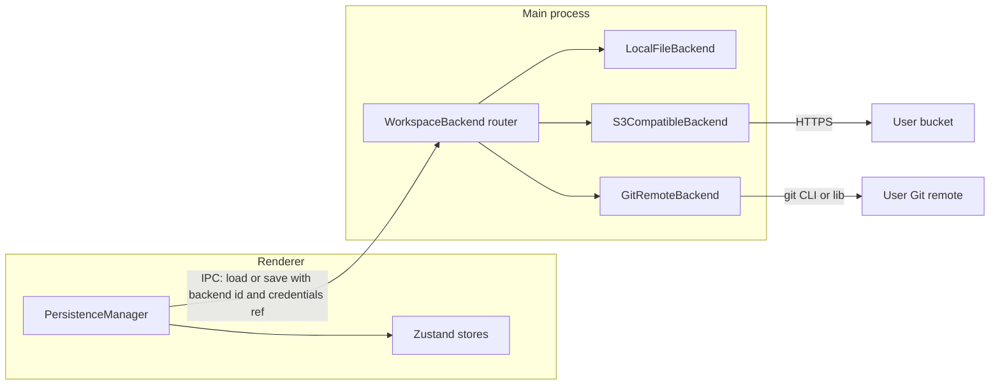

# BYO collection sync: S3 + Git, hybrid-ready

## Current baseline

- The editable state is a single document, `[WorkspaceData](src/renderer/lib/persistence.ts)` (collections, environments, `activeEnvironmentId`, `selectedRequestId`), serialized to JSON.
- Persistence today is **local file only**: `[PersistenceManager](src/renderer/components/PersistenceManager.tsx)` debounces saves; the main process reads/writes `[userData/workspace.json](src/main/ipc.ts)` via `workspace:load` / `workspace:save`.
- The renderer already treats persistence as async (`loadWorkspace` / `saveWorkspace`), which is a good fit for remote I/O once the **backend** is abstracted.

## Target architecture (first pass)

**Design principle:** No BewareOfDog accounts. Credentials and endpoints live **on the user’s machine** (OS keychain via Electron `[safeStorage](https://www.electronjs.org/docs/latest/api/safe-storage)` or a small encrypted JSON in `userData` + `safeStorage` for secrets). The app only stores **references** (e.g. “use S3 backend, profile id `work`”).

### 1) Abstract a workspace backend contract

Define a small shared interface (conceptually; place under `[src/shared/](src/shared/)` or a new `src/shared/workspaceBackend/`):

- `**load()`** → `{ data: WorkspaceData | null, versionToken: string | null }`  
  - `versionToken` maps to **S3 ETag** or **Git commit SHA** (or `null` for local-only).
- `**save(payload, { ifVersionMatch?: string })`** → `{ ok: boolean, versionToken: string, conflict?: boolean }`  
  - **S3:** `If-Match` / `If-None-Match` semantics using object ETag (or conditional PUT via SDK).
  - **Git:** `save` = commit + push; conflicts = merge conflict state surfaced to UI (or block until resolved).

**Local backend** is the current behavior: always `versionToken` unused or a stable sentinel; no conflict.

**Router:** Persisted **settings** (which backend is active, profile ids) in main; IPC exposes `workspaceLoad` / `workspaceSave` that delegate to the selected backend (or extend preload with explicit `getWorkspaceSettings` / `setWorkspaceBackend` — exact IPC shape is an implementation detail).

This refactor is the prerequisite for both S3 and Git without duplicating logic in the renderer.

### 2) S3-compatible connector (BYO object storage)

- **Scope:** One object key per workspace (e.g. `prefix/workspace.json`) for v1 — matches today’s single JSON blob and minimizes moving parts.
- **Implementation:** AWS SDK v3 **S3 client** in the **main** process (Node-friendly; avoids CORS and keeps keys out of the renderer). Support **custom endpoint** for MinIO, R2, etc.
- **Concurrency:** On load, store **ETag**; on save, send **conditional PUT** so two users do not silently overwrite (surface “remote changed” / conflict).
- **UX:** Minimal settings screen: endpoint, region, bucket, prefix, access key id, secret (or session token), “Test connection”, “Pull from remote”, “Push to remote”. Optional: “Sync on save” toggle vs manual pull/push only.

**Files likely touched:** `[src/main/ipc.ts](src/main/ipc.ts)` (new handlers or shared router), `[src/preload/index.ts](src/preload/index.ts)`, `[src/renderer/lib/persistence.ts](src/renderer/lib/persistence.ts)`, new main modules for S3.

### 3) Git connector (BYO Git host)

- **Scope v1:** Same **single file** in the repo (e.g. `bewareofdog/workspace.json`) to align with current `WorkspaceData` shape.
- **Implementation options** (pick one in implementation; both are valid):
  - `**simple-git`** + **system Git** (smaller install, assumes Git on PATH — reasonable for this audience).
  - **Embedded Git** (e.g. **dugite**) if you need zero dependency on host Git — larger binary, more work up front.
- **Flow:** Clone or open existing clone path under `userData`/`git-workspaces/<profileId>`; **pull --rebase** (or merge) before applying edits; **commit + push** on save or explicit “Sync”. **Conflicts:** if `git` reports conflict, show status and block until user resolves (v1 can be “open folder in Finder” / manual fix + retry, or a simple text merge later).

**Files:** New main-process Git service; same backend interface as S3; settings UI for remote URL, branch, credentials (PAT or SSH is harder in Electron — **HTTPS + PAT** is often simplest for v1).

### 4) Path to **hybrid (6)** — soon, not blocking first merge

- **Local remains the fast path:** Keep **LocalFileBackend** as default; optionally **mirror** to remote on interval or explicit action.
- **Unify version semantics:** Use `versionToken` everywhere so the UI can show “Remote newer” / “Conflict” regardless of S3 vs Git.
- **Documented combinations for later milestones:**
  - **Git as source of truth** + periodic export to S3 (backup) — two backends orchestrated by a thin “sync coordinator” in main.
  - **S3 for dumb blob** + **Git for audit** — only if you split artifacts (usually overkill until users ask).

No need to build the coordinator in the first PR; **design the interface** so `versionToken` and explicit **pull/push** fit a second-phase “hybrid sync manager.”

### 5) Future consideration only (no implementation in first pass)

- **P2P / local-first CRDT (4):** Mention in README/roadmap as optional advanced privacy; requires rendezvous/signaling or user burden — out of scope.
- **Customer-run relay server (5):** Real-time presence and WebSocket sync without third-party Git/S3 — out of scope; document as enterprise/self-hosted option later.

## Dependencies and security notes

- Add `**@aws-sdk/client-s3`** (and optionally `**@aws-sdk/s3-request-presigner`** only if you later move signing — not required for main-process SDK).
- Add `**simple-git`** (if using system Git) or `**dugite`** (if bundling Git).
- **Secrets:** Never log credentials; prefer **safeStorage** for encrypting stored profiles; document IAM policy examples for S3 (least privilege: `s3:GetObject`, `s3:PutObject` on prefix).

## Testing strategy (lightweight)

- **Unit:** Parse/serialize round-trip for `WorkspaceData` unchanged; mock S3/Git in tests if you add a test runner later.
- **Manual:** Two profiles against same bucket/branch — verify ETag conflict and Git conflict paths.

## Success criteria for v1

- User can choose **Local**, **S3-compatible**, or **Git** workspace backend from settings.
- **No** BewareOfDog-hosted auth or database.
- **Explicit** conflict behavior (no silent overwrite) for S3; Git conflicts surfaced clearly.

