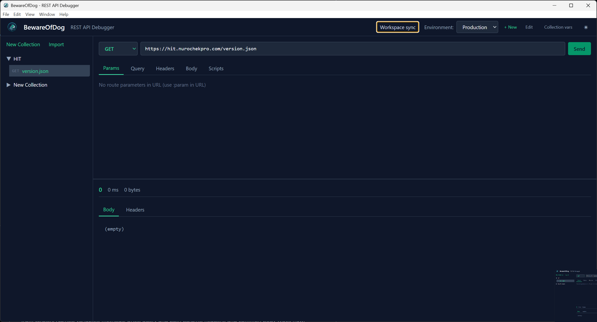

# Beware Of Dog

**REST API debugging that stays yours.** A focused desktop client for building requests, inspecting responses, and sharing API workspaces—without renting team sync from a gatekeeper.




## Why BewareOfDog?

You already know how to call HTTP APIs. What you need is a **fast, local-first tool** that respects collections and environments—and when your team needs a shared source of truth, **you choose where it lives**. No BewareOfDog account. No surprise “team tier” invoices. Your credentials stay on your machine (encrypted with the OS where supported), and your data sits in **your** S3-compatible bucket or **your** Git remote.

Built for people who liked the *simple* parts of the incumbent tools and resented paying enterprise rent for them.

## Features

- **Request builder**: Method, URL, route/query params, headers, JSON body with lightweight syntax coloring, and per-request auth. Invalid or unresolved URLs are caught before the request runs.
- **Variables**: Environment and collection variables with `{{var}}` interpolation; hover supported fields to see **resolved values** (with scope when it helps).
- **Response view**: Status, timing, headers, and body with JSON-aware coloring (keys vs values). **Copy** the response body in one click.
- **HTTP console**: A docked log of recent requests and responses—handy when you’re iterating fast.
- **Collections**: Full CRUD; import **Postman Collection v2.1**, **OpenAPI 3.x** (JSON), or native JSON; export as portable BewareOfDog JSON.
- **Environments**: Named variable sets (Dev, Staging, Prod, …)
- **Workspace sync (BYO)**: Local file, **S3-compatible** storage, or **Git**—pick the backend in *Workspace sync* (see below)
- **Persistence**: Main window size and position, plus left/right panel widths, are remembered locally between sessions.
- **Updates** (packaged installs): Background check against **GitHub Releases**; prompts to restart when a new installer is ready (via `electron-updater`).
- **Keyboard shortcut**: Ctrl+Enter to send
- **Themes**: Dark / light
- **Post-request scripts**: Sandboxed JavaScript with a `bod` API for chaining tokens, assertions, and variable updates—editor includes syntax coloring, Tab inserts spaces, and **autocomplete for `bod`** (request, response, environment, collection variables).

## Workspace sync—your cloud, your repo

Stop exporting ZIPs to Slack. BewareOfDog persists your whole workspace (collections, environments, **which request is selected**, and the **last successful HTTP response** for that request when applicable) as a single JSON document and lets you **back it with infrastructure you already pay for**:

| Mode | Best for |
|------|----------|
| **Local file** | Solo work, air-gapped, or default until you wire a remote |
| **S3-compatible** | AWS S3, Cloudflare R2, MinIO, etc.—one object (`…/workspace.json`), **conditional writes** so two people don’t silently overwrite each other |
| **Git** | Teams that already live in GitHub/GitLab—history, review, and branch workflows you already trust |

**What you get**

- **No vendor-hosted database** and no BewareOfDog login—just connectors to *your* storage.
- **Explicit conflict handling** when the remote changed (S3 ETags; Git pull/rebase before push).
- **Secrets** stored with Electron **safe storage** where the OS supports it.

Open **Workspace sync** from the header to add profiles, test connectivity, switch the active backend, and pull the latest workspace from remote.

*Git mode expects [Git](https://git-scm.com/) on your `PATH`. HTTPS + a personal access token is the smoothest first setup.*

## Quick Start

```bash
npm install
npm run dev
```

## Releases (installers)

Pre-built installers are published on the repository’s **Releases** tab for each tagged version. Choose the asset for your platform:

| Platform | File |
|----------|------|
| Windows | NSIS installer (`.exe`) |
| macOS | Disk image (`.dmg`) |
| Linux | AppImage (`.AppImage`; `chmod +x` if your browser strips execute permission) |

macOS builds are not notarized; you may need to use **Open** from the context menu the first time you launch the app.

## Collection Format

```json
{
  "name": "My API",
  "variables": [
    { "key": "baseUrl", "value": "https://api.example.com" }
  ],
  "requests": [
    {
      "id": "uuid",
      "name": "Get User",
      "method": "GET",
      "url": "{{baseUrl}}/users/:userId",
      "routeParams": [{ "key": "userId", "value": "123" }],
      "queryParams": [{ "key": "include", "value": "profile" }],
      "headers": [],
      "body": null,
      "postRequestScript": null
    }
  ]
}
```

## Import formats

**OpenAPI 3.x.** Use **Import** in the collections panel with an OpenAPI **JSON** document (paste or file). Operations become requests; servers and path/query parameters are mapped where possible so you can send traffic quickly from a spec you already trust.

**You can bring your existing Postman work.** BewareOfDog imports **Postman Collection v2.1**—export your collection from Postman, use **Import** in the collections panel, and you’re back to a full request list without rebuilding endpoints from scratch. Names, variables, methods, URLs, query and path params, headers, and common body types (raw, urlencoded, typical form and GraphQL shapes) come across; Bearer, Basic, and API-key-in-header auth map to headers so you stay productive on day one.

**Your collections, your format on disk.** For save, backup, and workspace sync, BewareOfDog uses the open **BewareOfDog JSON** shape shown under [Collection Format](#collection-format)—readable, diff-friendly, and a natural fit for Git and S3-backed workspaces. That’s the format **Export** uses: portable, yours, and aligned with how the app stores data—not a closed vendor bundle.

**After a Postman import**, the app shows a short, dismissible summary if anything needed a human pass (for example Postman-only scripts, saved response examples, or advanced auth). Most API surfaces import cleanly; the summary is there so nothing surprises you later.

**Edge cases you might adjust by hand** (also summarized after import when they apply): Postman pre-request and test scripts (`pm.*`) aren’t carried over—BewareOfDog uses its own sandboxed `bod` post-request scripts instead. Saved example responses, protocol/proxy/certificate extras, OAuth2 and similar auth helpers, multipart file uploads, oddball header encodings, and API keys meant for the query string may need a quick tweak in the builder.

## Environment Format

```json
{
  "name": "Development",
  "variables": [
    { "key": "baseUrl", "value": "http://localhost:3000" }
  ]
}
```

## Post-request Scripts

Scripts run in a sandboxed context with access to the `bod` object. The script editor highlights JavaScript, inserts four spaces on Tab (so focus doesn’t jump away), and suggests members after you type `bod.` (for example `bod.response.json()`).

```javascript
// bod.request - { method, url, headers }
// bod.response - { status, statusText, headers, body, json(), text() }
// bod.environment.get(key) / bod.environment.set(key, value)
// bod.collectionVariables.get(key) / bod.collectionVariables.set(key, value)

const json = bod.response.json();
if (json.token) {
  bod.environment.set('token', json.token);
}
```

## S3 tip (least privilege)

For a dedicated prefix, narrow IAM to `s3:GetObject` and `s3:PutObject` on `arn:...:your-bucket/your-prefix/*` (plus `s3:ListBucket` with a prefix condition if your workflow needs listing). Adjust for your org’s standards.

## Build

```bash
npm run build
```

### Desktop packages (local)

```bash
npm run dist
```

This runs `electron-vite build`, regenerates icons from `public/bod.png` (`npm run icons`), and produces installers under `release/` (Windows NSIS, macOS DMG, Linux AppImage). Use `npm run dist:dir` for an unpacked directory only (no installer).

### Auto-updates (`electron-updater`)

This follows the common **electron-builder + electron-updater** pattern (same tooling many Electron apps use):

1. **Version** — The build stamps **`package.json` → `version`** into the app. At runtime the main process uses **`app.getVersion()`**; the UI shows it via **`window.electron.appGetVersion()`**. Tags and `package.json` must stay in sync (your release workflow already enforces this).

2. **Where updates come from** — `electron-updater` reads **GitHub Releases** for the repo declared in **`package.json` → `repository`**. Set the `url` to your real GitHub repo (replace the `YOUR_GITHUB_ORG` placeholder in the template). electron-builder bakes the feed into the packaged app.

3. **What to upload** — Each OS build outputs an installer **and** update metadata (`*.yml`, e.g. `latest.yml` / `latest-mac.yml` / `latest-linux.yml`) in `release/`. The **release workflow** attaches those YAML files next to the `.exe`, `.dmg`, and `.AppImage` so clients can compare versions and download the right asset for the current platform.

4. **When it runs** — Update checks run only in **installed** builds, not in `npm run dev`. After launch, the app checks in the background; when a full update is downloaded, it offers **Restart now** to install.

5. **macOS** — Unsigned builds may hit Gatekeeper or update limitations; **code signing** (and ideally **notarization**) is recommended for smooth updates in production.

6. **Manual check** — The header includes **Check for updates**, or call **`window.electron.checkForUpdates()`** yourself. In dev it returns `{ ok: false, reason: 'development' }`; when packaged, `{ ok: true, isUpdateAvailable, availableVersion }` after the GitHub check finishes.

### Publishing a release (maintainers)

1. Set `version` in `package.json` to the release (for example `0.2.0`) and commit.
2. Tag and push: `git tag -a v0.2.0 -m "v0.2.0"` then `git push origin v0.2.0`.

The tag **must** be `v` plus the exact `package.json` version (e.g. tag `v0.2.0` ↔ version `0.2.0`). Pushing the tag runs GitHub Actions, which builds Windows, macOS, and Linux artifacts and attaches them to the GitHub Release for that tag (installers plus `*.yml` update metadata for auto-update).

---

*BewareOfDog: debug APIs, share workspaces, keep the keys.*
