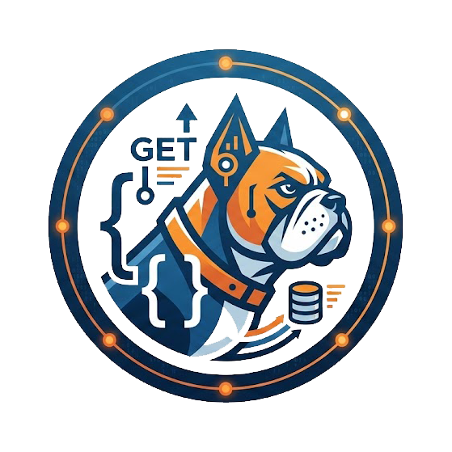

# Beware Of Dog
REST API Debugger - An Electron application for debugging REST APIs.



## Features

- **Request Builder**: Method selector, URL bar, route params, query params, headers, body
- **Response View**: Status, timing, body (JSON/text), headers
- **Collections**: JSON collection format, import/export, CRUD
- **Variables**: Environment variables and collection variables with `{{var}}` interpolation
- **Environments**: Named sets of variables (Dev, Staging, Prod)
- **Keyboard shortcut**: Ctrl+Enter to send request
- **Theme**: Dark/light mode toggle
- **Post-request scripts**: JavaScript that runs after each response with a `bod` API (request, response, environment/collection variables)

## Quick Start

```bash
npm install
npm run dev
```

## Collection Format

```json
{
  "name": "My API",
  "variables": [
    { "key": "baseUrl", "value": "https://api.example.com" }
  ],
  "requests": [
    {
      "id": "uuid",
      "name": "Get User",
      "method": "GET",
      "url": "{{baseUrl}}/users/:userId",
      "routeParams": [{ "key": "userId", "value": "123" }],
      "queryParams": [{ "key": "include", "value": "profile" }],
      "headers": [],
      "body": null,
      "postRequestScript": null
    }
  ]
}
```

## Environment Format

```json
{
  "name": "Development",
  "variables": [
    { "key": "baseUrl", "value": "http://localhost:3000" }
  ]
}
```

## Post-request Scripts

Scripts run in a sandboxed context with access to the `bod` object:

```javascript
// bod.request - { method, url, headers }
// bod.response - { status, statusText, headers, body, json(), text() }
// bod.environment.get(key) / bod.environment.set(key, value)
// bod.collectionVariables.get(key) / bod.collectionVariables.set(key, value)

const json = bod.response.json();
if (json.token) {
  bod.environment.set('token', json.token);
}
```

## Build

```bash
npm run build
```
